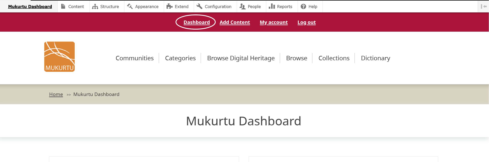
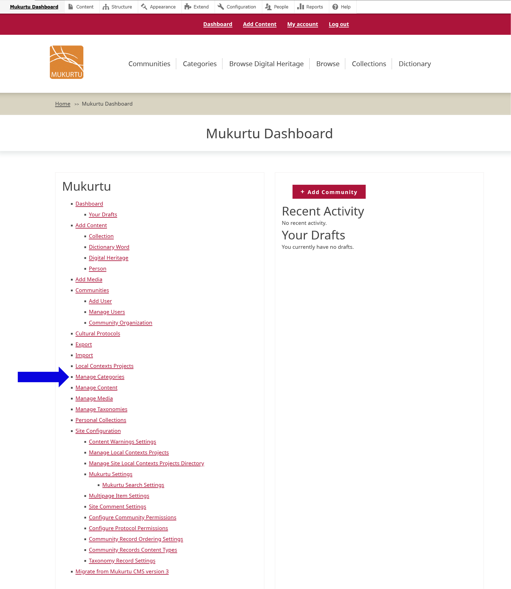
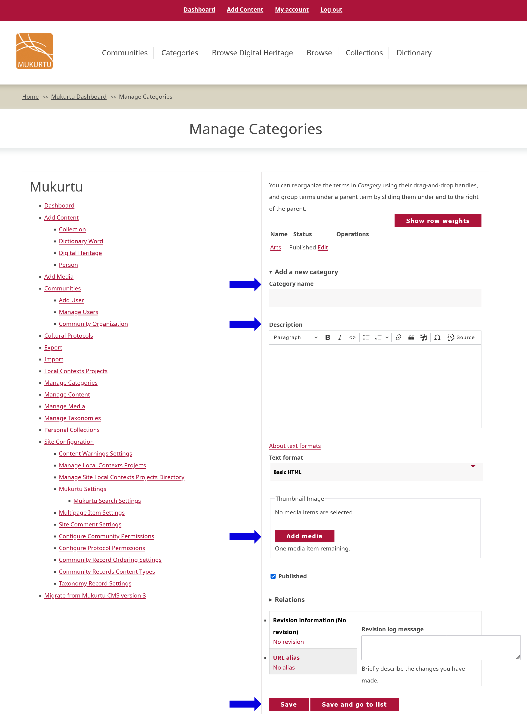

# Creating and Editing Categories

## To create a new category, navigate to your dashboard. 

- Select **Manage Categories**. 

- Select **Add a New Category**

- Type the name of your category in the *Category Name* field.  
- Type any descriptive information in the *Description* field. This is a rich text field that can support text, links, media items, and other formats. 

- Apply a thumbnail image to your category. The thumbnail image appears on your front page and can help further clarify your category for users. 
- Select **Add media**. Select **Browse** to upload a file or scroll down to select images that have already been uploaded.  
- Allowed file types are .png, .gif, .jpg, or .jpeg. 

- Select **Insert selected** to apply the image to your category as a thumbnail. 
- Select the checkbox by **Published** to publish your category or leave unselected to save your category as a draft. 

## To edit your category, navigate to your Dashboard.  

- Select **Manage Categories**. 
- Select the **Edit** button in the row you want to make changes to. 
- Edit your *Category Name*, *Description*, or *Thumbnail Image*, then select **Save**.