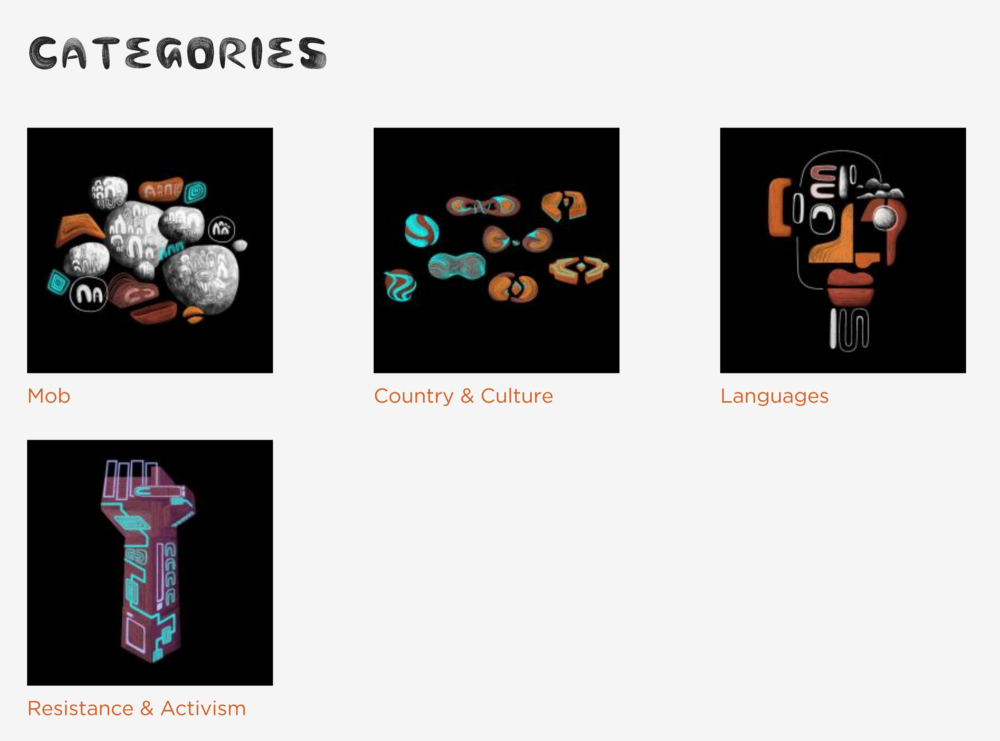

# Understanding Categories

- User Role: Mukurtu Administrators

Categories are high-level descriptive terms that help users discover digital heritage items.

If the categories are too broad they won’t help users narrow down their search, but if they are too narrow they may not represent the scope of the site. Make sure that the category terms you choose make sense to your users by avoiding jargon and overly technical terms.

Each digital heritage item must belong to one or more category, so select categories to reflect the types of items within your site. Most sites have between 10-15 categories. All communities on the site share the same set of categories.

If more granular terms are needed, other taxonomies such as keywords can be applied.

There are many different ways that categories can be used to help users navigate digital heritage items. Some examples include:

 

[The Plateau Peoples' Web Portal](https://plateauportal.libraries.wsu.edu/)

[The Passamaquoddy People](https://passamaquoddypeople.com/) 
 At Home on the Ocean and the Lakes 

[Gather](https://gather.sl.nsw.gov.au/) 
 Connecting Aboriginal communities with collections and stories from the State Library of New South Wales. 

