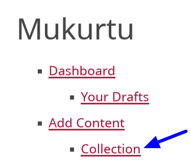
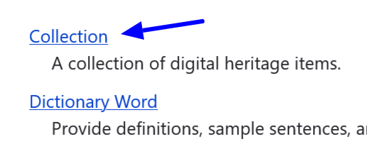
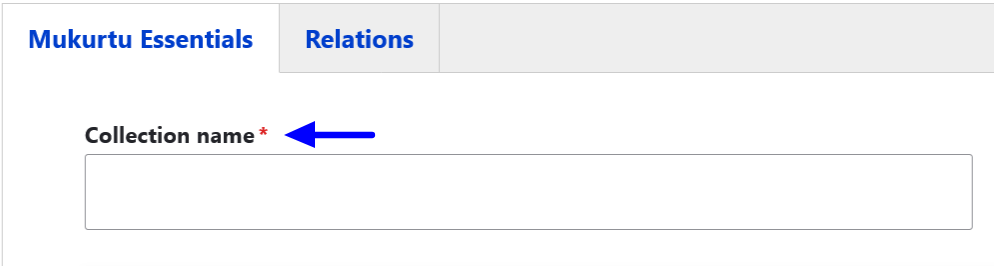
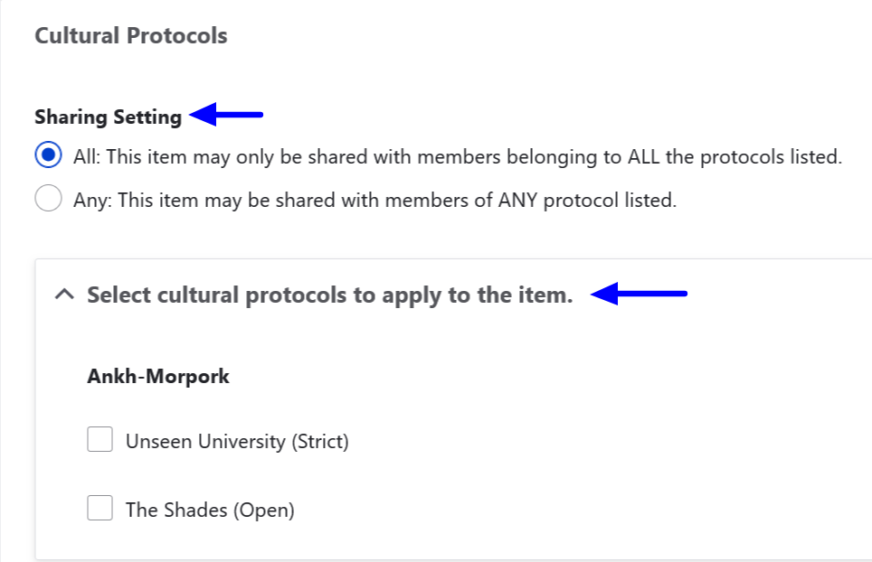
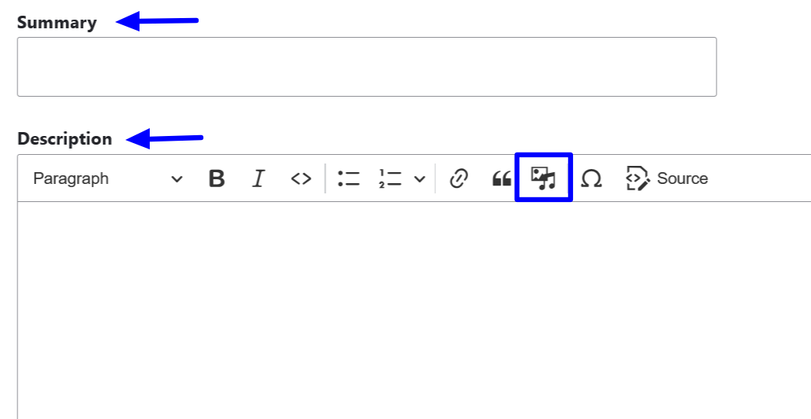
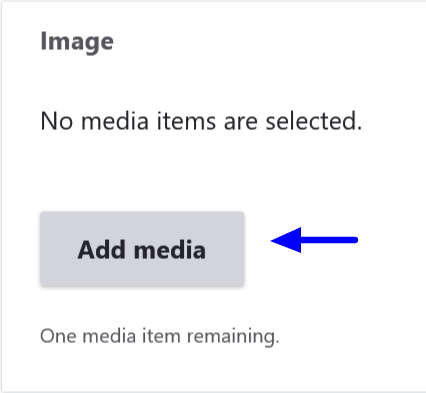
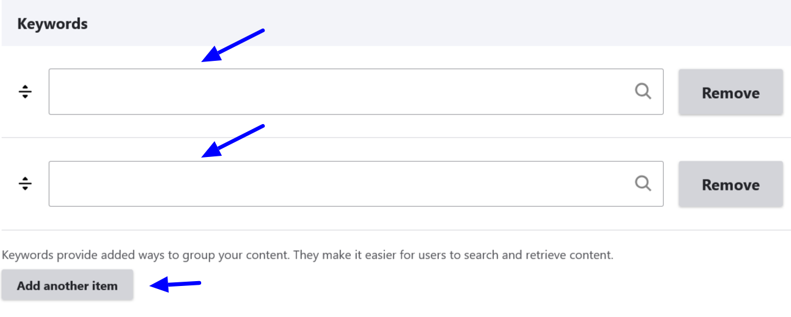

# Create a Collection

You can create a collection in Mukurtu from your **Dashboard** or by selecting **Add Content**.

To create a collection from your dashboard, select **Dashboard** and scroll down to the **Collection** link. 

From **Add Content** select the **Collections** link.

The remaining steps to create a collection are the same.

## Steps to create a collection 

We will start with filling out the information contained in the **Mukurtu Essentials** tab. 

1. Use the *Collection name* field to provide a name for your collection.

2. Select a sharing setting and applicable cultural protocols. Sharing setting has two options: you can select **Any** or **All**. Any is the less restrictive setting as it means that the content can be shared with people belonging to any one or more of the protocols selected. All is more restrictive as users must belong to all the protocols selected to view the collection.

> Collection name, sharing settings, and cultural protocols are required fields.

3. Use the *Summary* field to provide a summary of your collection. This field is limited to 255 characters. 

4. Use the *Description* field to provide a description of your collection. This is a full HTML field that can also supports additional media items.

5. Use the *Image* field to select a representative thumbnail image for your collection.

6. Select any *Keywords* you want to apply to your collection. If you need to add more than two keywords, select the "Add another item" button to add additional fields.

7. In the *Source* field provide information indicating the resource, collection, or institution where the collection was contributed or originated.  

8. Select a location for your collection. You can include points, paths, rectangles, or polygons to indiciate the physical location reference for your collection. **IDEALLY THIS SHOULD LINK TO A MAPPING TUTORIAL**
    - To add a point, select the first draw marker at the top right of the map. 
    - To add a polyline, select the second draw marker to the right of the map.
    - To add a rectangle, select the third draw marker to the right of the map.
    - To add a polygon, select the fourth draw marker to the right of the map.
    
9. Add a *Location Description*. This field can be used to add additional context to the mapped location. If a location is identified but not precisely located on a map this field can be used instead of the mapped location. This is a full HTML field that can also supports additional media items.

10. In the *Location* field, provide a taxonomic location term for your collection.

You can save your Collection at this point. Return to the top of your page to select the **Relations** tab to add content to your collection.

11. In the **Items in Collection** section, select the "Select Content" button. Digital heritage items, person records, dictionary words, and other content items can be included in a collection. 

12. Select the checkbox beside all the content items you wish to include in the collection, then scroll down and select "Add Content".

If you choose to create any sub-collections, they can be added by selecting the "Select Content" button in the **Sub-Collections** section. Sub-collections must have already been created to be added from this section.

If you have any related content to the collection, select the "Select Content" button in the **Related Content** section.

13. Select whether you want to save this collection as a draft or as a published collection. Select either **Draft** or **Published**, then select the "Save" button. You also have the option to preview your collection by selectin "Preview".

