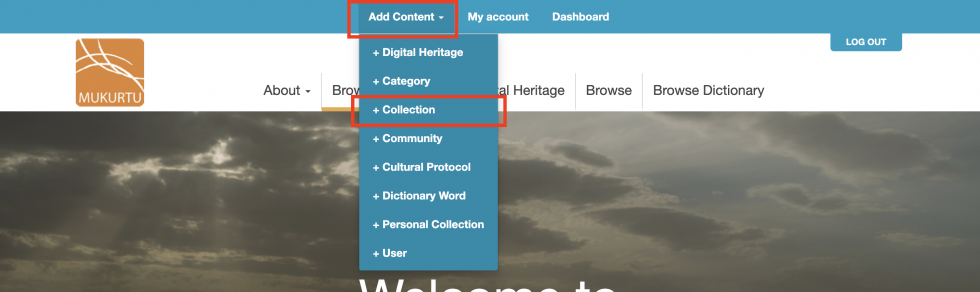
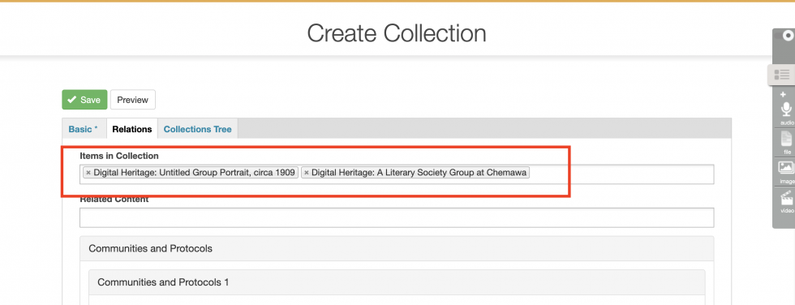
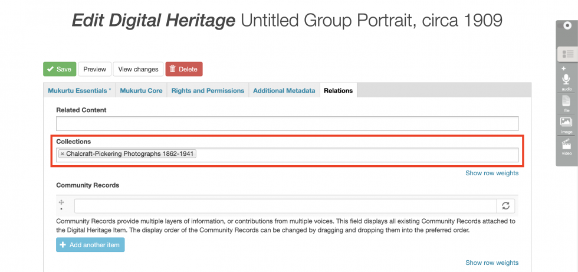

# Creating Collections

The default Browse view in Mukurtu CMS shows all digital heritage items on the site that a user has access to (based on the Cultural Protocols that they are a member of), in order of most recently created or edited. Users can search of browse from this view to find content.

To provide users with a more curated or guided experience, create Collections. Collections are groups of items selected by a user with the Curator role. Collections can have title, description, and a featured image, and the order in which items are displayed within a collection can be controlled by the Curator. Digital heritage items from across the site, and from many Cultural Protocols, can be included in one Collection, and users will only see those items they have access to (based on the Cultural Protocols that they are a member of).

> Note: While access to individual digital heritage items within a Collection is managed by Cultural protocols, Collections themselves, their titles, descriptions, and featured images will all be publically visible.

To create a Collection, in the main navigation menu, click **Add Content** and then **+Collection**.

## Basic Tab

- Collections must have a name, give the collection a descriptive name.
- A short summary will display on the Collections landing page (yoursiteurl.com/collections), give the collection a brief, descriptive summary.
- The rich-text description field supports a longer description of the collection, and can include images, audio, and video.
- The image will display on the Collections landing page, as well as above the description on the collection page. If you do not assign an image, the system will automatically select one from items in the collection.

## Relations Tab

Use the **Relations Tab** to select which content to add to the collection.

To add a digital heritage item or dictionary word to the collection, click on the **Items in Collection** field. You can either scroll the alphabetical list and select items, or begin typing the title of the item or word and select from the narrowed results. Repeat as needed.

Click **Save** when done.

Items can also be added to collections from the **Edit Digital Heritage Item** page. On the **Relations Tab**, begin typing the name of the collection, and select the appropriate collection from the drop-down list.

See [Adding cultural protocols to collection pages](https://mukurtu.org/support/adding-cultural-protocols-to-collection-pages/) and [Related content](https://mukurtu.org/support/related-content/) for more advanced collections tools.

##  Collections Tree

See [Managing sub-collections](https://mukurtu.org/support/managing-sub-collections/) for more information on the **collections tree tab**.
