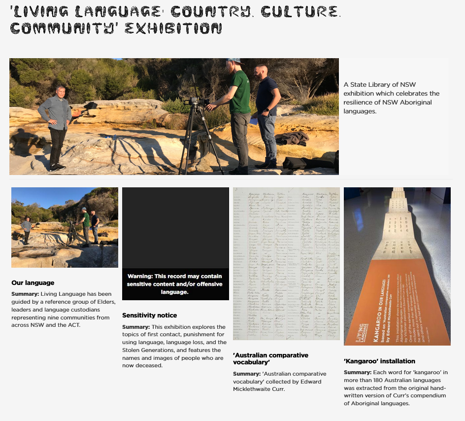
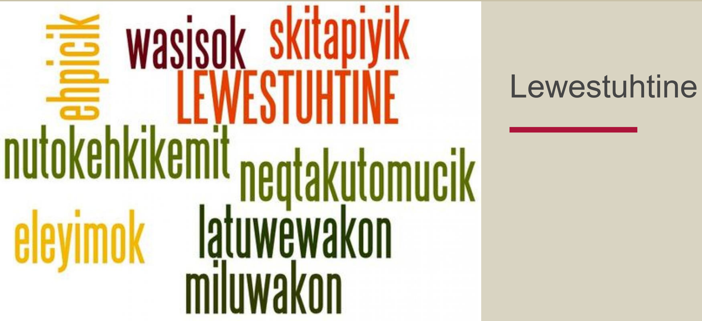
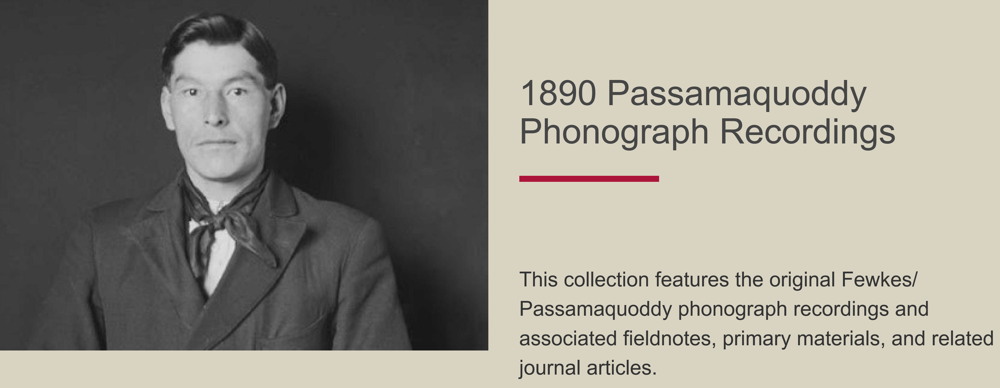
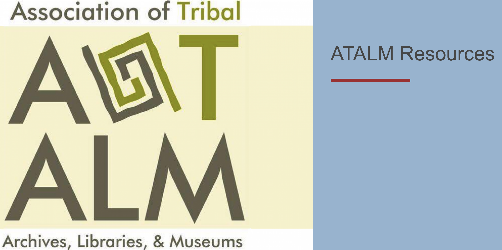

# Understanding Collections
- User roles: Protocol steward and Curator

There are two types of collections in Mukurtu: Personal collections and collections curated by protocol stewards and curators. The bulk of this article addresses administrator curated collections. For more information on personal collections, please select the Personal Collections subheading in this article. 

## Collections 

The default browse view in Mukurtu sorts content items by the most recently updated, which may not be the way communities prefer to organize some content. To provide context or connections for some items or groups of items, communities may choose to use Mukurtu's Collections feature. Collections are a useful feature that can help protocol stewards and curators arrange content items in ways that help provide a more comprehensive context for those items. The creator of the collection determines the way the collection is arranged, including the order in which content items are displayed. Users only see those items they have access to based on their cultural protocols. Collections provide users with a more curated or guided experience of the site's content.

There are many options for ways to use the collections feature. Some communities use it to create digital exhibits, such as Gather's [Living Language: Country, Culture, Community Exhibition](https://gather.sl.nsw.gov.au/collection/living-language-country-culture-community-exhibition).

Some communities use it to format educational resources and provide access to lesson plans and materials, such as the Passamaquoddy People's [Lewestuhtine collection](https://passamaquoddypeople.com/collection/lewestuhtine). 

The Passamaquoddy People also used the collections feature to provide structure and context for the [1890 Passamaquoddy Phonograph Recordings](https://passamaquoddypeople.com/collection/1890-passamaquoddy-phonograph-recordings), which feature the digitized phonograph recordings as well as associated field notes and related journal articles.

Another example of how collections have been used is from the Sustainable Heritage Network, who used the collections feature to provide consolidated access to resources from the [Association of Tribal Archives, Libraries, and Museums (ATALM)](https://sustainableheritagenetwork.org/collection/atalm-resources) including full sessions, short video tutorials, presentations, and speeches from the 2014-2019 ATALM Annual Conferences.

## Personal Collections

Individual users can create personal collections of content items by adding them to their personal collection and arranging selected items in any way they choose. Users can designate their personal collections as either public or private by selecting the appropriate sharing setting when creating their collection.