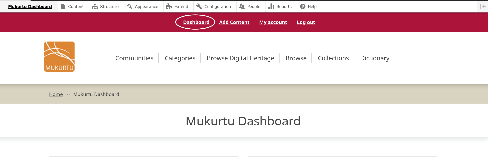
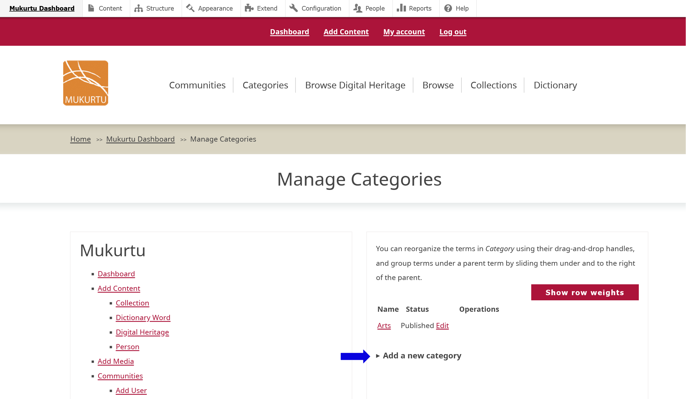
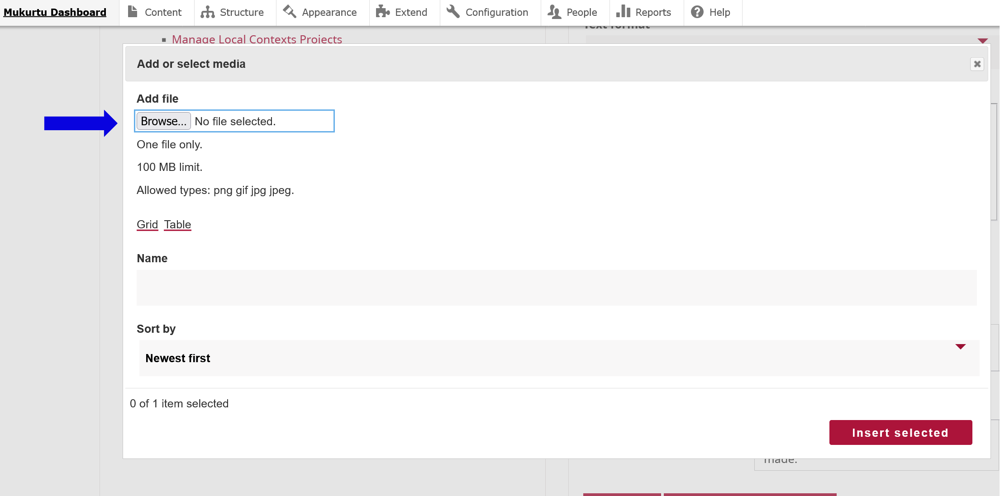

# Creating and Editing Categories - Mukurtu CMS 4.0 

Mukurtu 4 comes preloaded with a Default category. This might change.

## To create a new category, navigate to your Dashboard.  

- Select “Manage Categories”. 

- Select “Add a New Category” 
 
- Type the name of your category in the “Category Name” field.  
- Type any descriptive information in the “Description” field. This is a rich text field that can support text, links, media items, and other formats. 

- Apply a thumbnail image to your category. The thumbnail image appears on your front page and can help further clarify your category for users. 
- Select “Add media”. Select “Browse” to upload a file or scroll down to select images that have already been uploaded.  
- Allowed file types are .png, .gif, .jpg, or .jpeg. 

- Select “Insert selected” to apply the image to your category as a thumbnail. 
- Select the checkbox by “Published” to publish your category or leave unselected to save your category as a draft. 

    Is relations changing?

## To edit your category, navigate to your Dashboard.  

- Select “Manage Categories”. 
- Select the “Edit” button in the row you want to make changes to. 
- Edit your “Category Name”, “Description”, or “Thumbnail Image”, then select “Save”. 