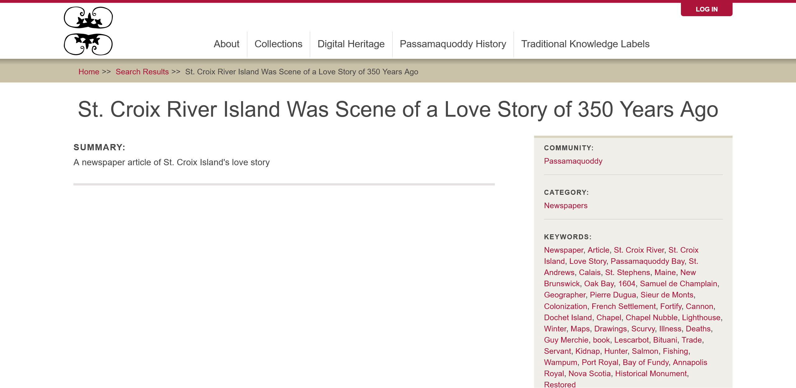

# Manage Media Access with Cultural Protocols

Cultural protocols must be directly added to all media assets in your media library. This is a new requirement for Mukurtu v4.

We strongly recommend applying the same cultural protocols to each media asset that are applied to the content items where the media asset is used. 

You can apply a strict protocol to a media asset and associate it with a content item with an open protocol. The media asset will not appear to users outside that protocol, but they can view the metadata from the open protocol. This might be desirable if you prefer to restrict some media assets while you share the associated metadata.

