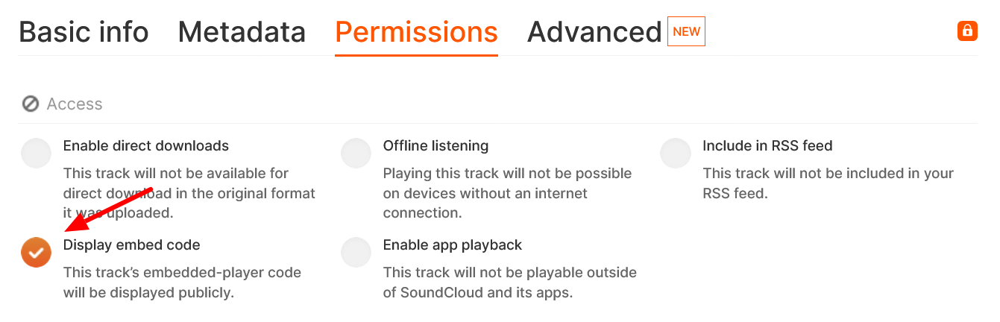

# SoundCloud Privacy Settings

SoundCloud offers limited privacy settings. [SoundCloud Privacy Information](https://help.soundcloud.com/hc/en-us/articles/115003562388-Changing-your-track-s-privacy-setting)

These privacy settings allow your tracks, albums, and playlists to be added to the Mukurtu media library and accessed by users. Content and media protocols apply. 
- **Public**
- **Private** 

**Scheduled** tracks are only available to paid Artist Pro subscribers. It allows you to schedule when your tracks shift from **Private** to **Public**.

## Embed permissions can limit function

Mukurtu cannot display SoundCloud media assets in content items without an embedded-player code. To enable this setting, select the ellipsis button on your SoundCloud asset.

Select Edit Track.

Select Permissions and make sure that Display embed code is selected. No other fields are required.

