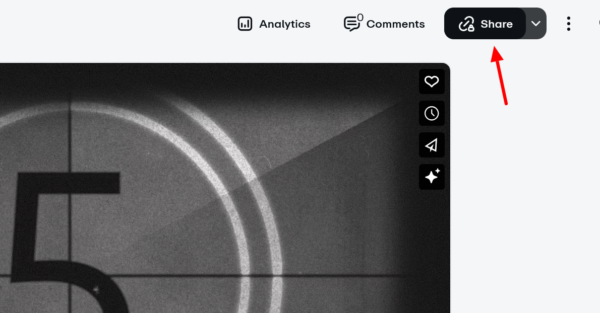
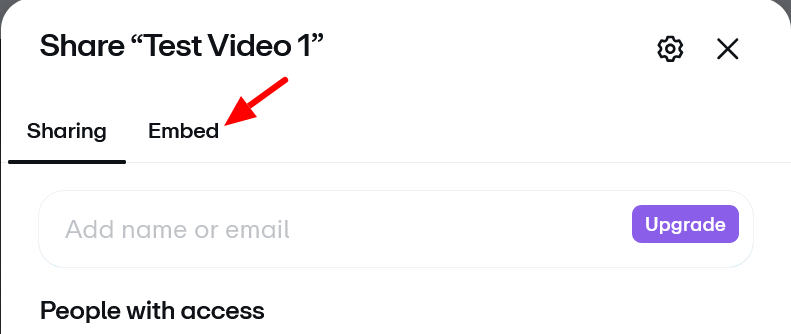

# Vimeo Privacy Settings

Vimeo's paid plans offer multiple privacy settings. [Vimeo privacy information](https://vimeo.com/features/video-privacy)

These privacy settings will allow your videos to be added to the Mukurtu media library and viewed by users. Content and media protocols apply.
- **Public**.
- **Unlisted**.
- **Hide from Vimeo**.

These privacy settings will not allow your videos to work as expected in Mukurtu.
- **Private**. You cannot add private videos to the media library. If a video is added and then set to private, it will no longer play in Mukurtu. 
- **Password**. You can add password protected videos to the media library, but the password will be required for a user to view the videos.

## Embed permissions can limit function

Mukurtu cannot display Vimeo media assets if **Embed privacy** is set to **Nowhere**. 

To enable this setting, select "Share". 

Select the **Embed** tab.

Set **Embed privacy** to **Anywhere**.

