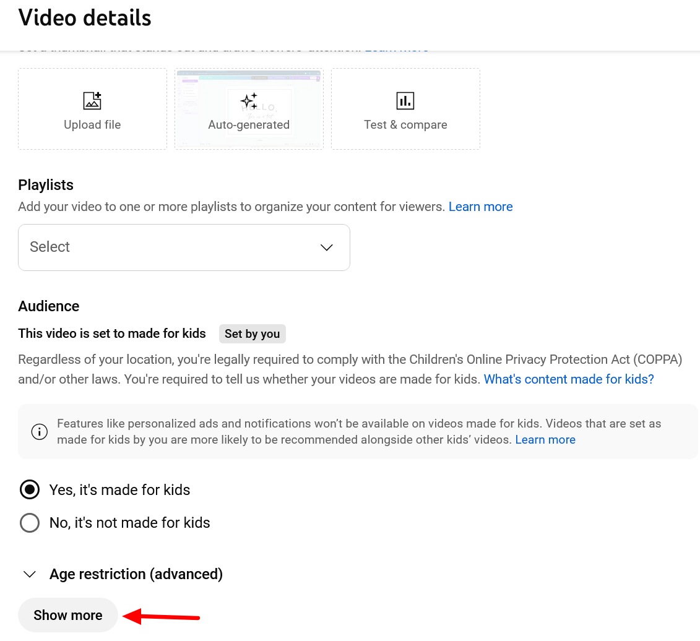
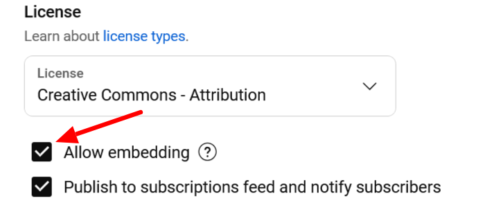

# Youtube Privacy Settings

Youtube offers limited privacy settings.

These privacy settings will allow your videos to be added to the Mukurtu media library and viewed by users. Content and media protocols apply.
- **Public**.
- **Unlisted**.

These privacy settings will not allow your videos to work as expected in Mukurtu.
- **Private**. You cannot add private videos to the media library. If a video is added and then set to private, it will no longer play in Mukurtu. 

## Embed permissions can limit function

Mukurtu cannot display YouTube media assets if Allow embedding is not enabled. To enable this setting, select **Show more** in **Video details**.

Scroll down to Licensing and select **Allow embedding**.

