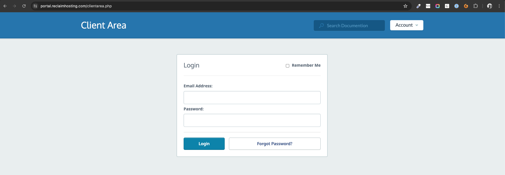
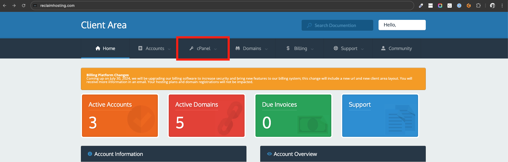
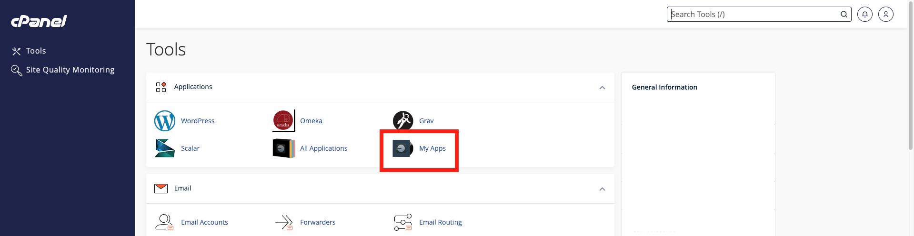
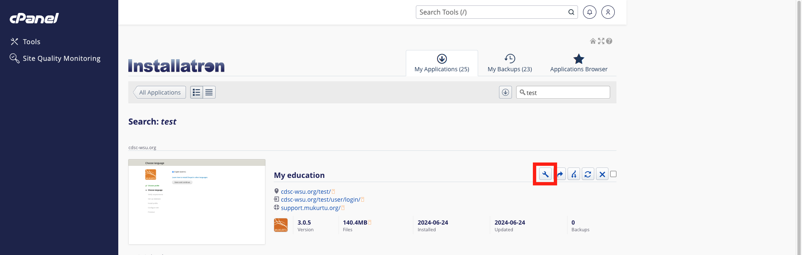
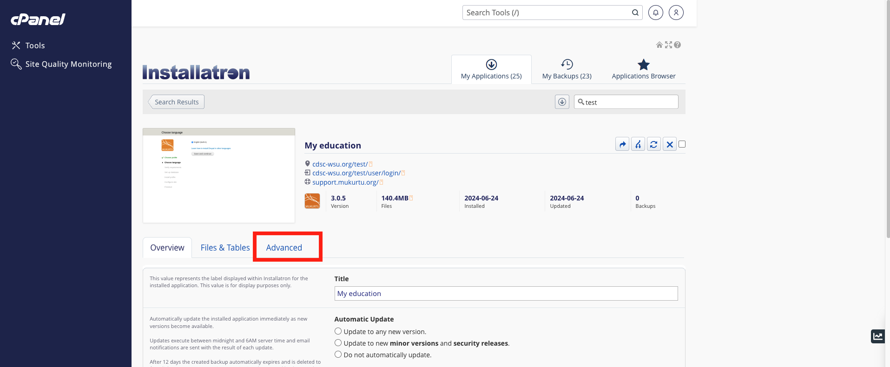
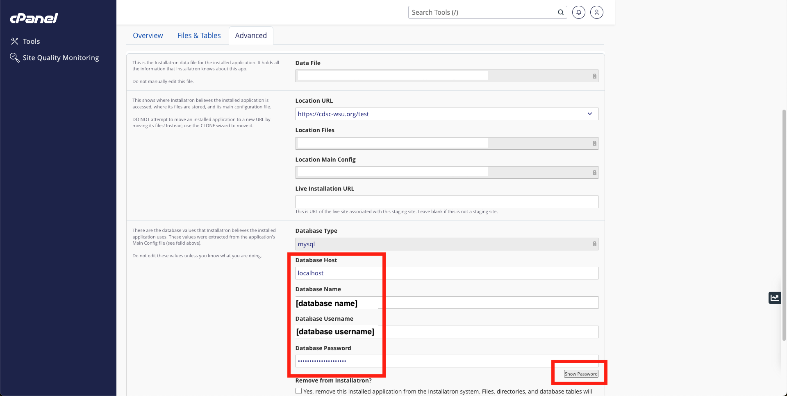

# 1) Migration Planning

There is a series of pre-migration planning activities you will want to undertake. Most of these are documentation oriented, though some may require additional research and testing.

## Documenting customization

If you have undertaken any customization of Mukurtu we strongly encourage you to document all your changes, whether cosmetic or functional. You will want to have a clear list of modifications so that you can identify what needs to be migrated, what needs to be re-created, etc.

Please contact us at [support@mukurtu.org](mailto:support@mukurtu.org) so that we can discuss your options and needs for migration and re-implementation. There will not be a one-size-fits-all solution, but we plan to document the common customizations reported by users and make workflows, tools, and any other resources available to all users to support everyone's migration efforts.

Customization includes, but may not be limited to:
- Adding new fields to existing content types.
- Disabling fields on existing content types.
- Modfying the data structure of existing fields.
- Creating new content types.
- Installing additional modules.
- Modifying any stock configuration (eg: user role permissions, search API).
- Modifying certain look and feel modifications (eg: navigation menu, content view modes).

> Custom themes and other look and feel modifications wil NOT be migrated. Custom themes will need to be re-designed and re-implemented to use the Drupal 10+ Twig theming environment. This is beyond our capacity to support.

## Preparing migration credentials

You will need to collect database credentials from your Mukurtu 3 site for use in your eventual migration. We recommend reviewing this well in advance and recoding this information somewhere accessible so you can copy and paste it into your new Mukurtu 4 site when prompted.

You will need to preapre the following database settings and credentials.
- Database type
- Database host
- Database name
- Database username
- Database password
- Document root for public files
- Document root for private files

> This assumes that you are migrating within the same hosting environment. If you are changing hosting providers or hosting environments please contact [support@mukurtu.org](mailto:support@mukurtu.org).

### Finding database credentials for Reclaim Hosted sites

Go to the Reclaim Client Portal ([https://portal.reclaimhosting.com/clientarea.php](https://portal.reclaimhosting.com/clientarea.php)) and login with your **Reclaim** account.



Click on "cPanel". If you have multiple accounts, select the correct account from the dropdown menu.



Click on " My Apps".



Locate your Mukurtu 3 site and click on the settings icon.



Select the "advanced" tab.



Record the following information. We recommend copying this into a local text document for future reference.
- Location Files
  - It will probably be something like "/home/[domain]/public_html/[site]"
  - This will be used to fill in the document root information.
- Database Type
  - It will probably be "mysql".
- Database Host
  - It will probably be "localhost".
- Database Name
  - It will probably be a randomly generated username.
- Database Username
  - It will probably be the same as the database name.
- Database Password
  - Click on the "show password" button to expose this.
  - It will be a randomly generated password.
 
> These are not the same credentials you use to log in to Reclaim or to the site itself.



### Finding database credentials for self hosted sites

Contact your server/system administrator. They should be directly involved in this process. If they have any questions about this information or the migration process, please contact [support@mukurtu.org](mailto:support@mukurtu.org).

### Using command line tools to find databse credentials

> Use command line tools with caution. If you are not familiar with command line tools contact your server/system administrator or use other tools.

Change to the directory with your Mukurtu settings.php file.
- On most hosts it will be something like /var/www/html/[sitename]/sites/default/files
- On Reclaim it will likely be either
  - For a single domain or sub-folder install (eg: mydomain.com or mydomain.com/mukurtusite): /public_html/[sitename]/sites/default
  - For a subdomain install (eg: mukurtusite.mydomain.com): /public_html/[sitename]/sites/default

For example, ```cd /var/www/html/[sitename]/sites/default/files```, ```cd public_html/[sitename]/sites/default```, or ```cd public_html/[sitename]/sites/default```.

Then run the cat command to display the contents of the settings.php file.

```cat settings.php```

Look for the database information. It will look something like this, and is *usually* the last information displayed.

```
$databases = array (
  'default' =>
  array (
    'default' =>
    array (
      'database' => '[database_name]',
      'username' => '[username],
      'password' => '[secret_password],
      'host' => 'localhost',
      'port' => '',
      'driver' => 'mysql',
      'prefix' => '',
    ),
  ),
);
```

Record this information. We recommend copying this into a local text document for future reference.
