# 3) Mukurtu 3 Pre-Migration Activities

The pre-migration report will identify all site content that needs to be updated or modified before it can be migrated to Mukurtu 4. The report will also identify any content settings that will not be migrated. 

> The pre-migration report and migration tools only address stock Mukurtu content and features. For example, if you have created a new content type, or added a new field, it will not be reflected in this report. Please contact [support@mukurtu.org](mailto:support@mukurtu.org) with any questions.

There are six categories included in the pre-migration report. A more detailed description of the changes for each is provided in the relevant section below.

1) Content (nodes) with no assigned protocols
2) Media assets (atoms) with no assigned protocols
3) Text formats: "Markdown" and "Display Suite code"
4) Dictionary words with additional media
5) Dailymotion media assets (atoms)
6) Scald authors field

## Run the pre-migration report and clear caches

It is best for these activities to be run by a Drupal administrator to ensure all content is addressed. Depending on how you have assigned protocol membership, the account may need to be enrolled in additional protocols to apply protocols to content and media.

You can access the pre-migration report directly at /admin/reports/migration/summary (eg: https://mysite.com/admin/reports/migration/summary).

You can also access the report by following the "View Migration Preparation Summary" link on your dashboard.

And you can access the report by following the "Reports" > "Pre-migration summary report" path from the Drupal administrator menu.

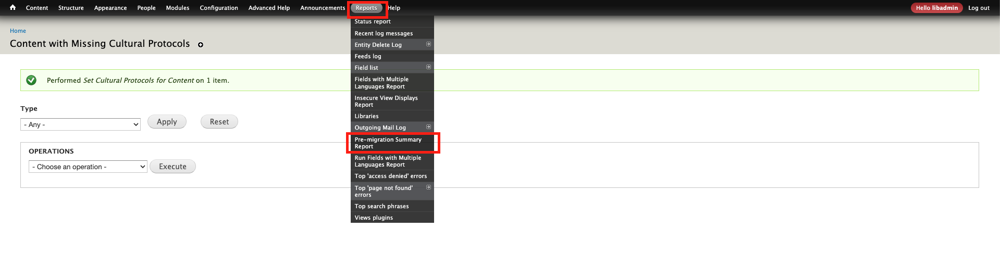

The report should run automatically, but you may need to click the "Run Pre-migration Report" button run the report. 

After running the pre-migration report, clear all site caches to ensure the report summary is updated. 
Hover over the home icon at the top left of the page, and click "Flush all caches". The page will reload when complete, which may take some time depending on the size of the site and server configuration.

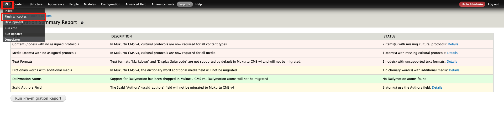

The report should automatically update as you complete the activities below. If the report summary does not automatically update, re-run the report and clear caches as shown above.

## Resolve pre-migration activities

Each category will have a summary in the "status" field on the right, which includes a link to a more detailed report and actions.

You should resolve the activities in the order displayed to avoid going through some steps multiple times. For example, a piece of content needs to have an assigned protocol before media used in that content can copy that protocol. 

In the "Status" column, click the "Details" link to view the report for each category.

### Content (nodes) with no assigned protocols

Content refers to digital heritage items, dictionary words, collections, word lists, and person records.

- In Mukurtu 3 protocols were optional for dictionary words and collections, and were not available for person records and word lists.
- In Mukurtu 4 cultural protocols are required for ALL content types.
- You will most likely be able to use the bulk processing tool to add protocols to all content without one, but some content may require manual editing.

The content with missing cultural protocols report displays all content that does not have a protocol assigned.
If you need to review a single piece of content, you can click on it's title to view. Opening content in a new tab is helpful so you don't have to navigate back to this page as often.

You can filter by content type. This is useful if, for example, you know that all dictionary words will continue to be public or all use the same private protocol, but other content will require more granular decisions. If relevant, select the content type and click "Apply".

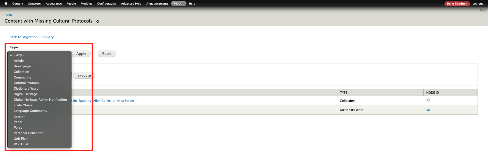

From the "Operations" dropdown, select "Set cultural protocols for content".

Select the content to be assigned a protocol using the check boxes. You can select all content by using the checkbox in the top row.
Please note that all content selected here will receive the SAME protocol(s) in the next step, so you will likely need to repeat this process multiple times for different groups of content.
Click "execute".

Select the appropriate item sharing setting - ANY or ALL. 
If the content will use only one protocol, either setting will work, but the default setting when creating new content on the site is ALL, in case you want to align with that.
If the content will use more than one protocol, choosing the correct setting is very important:
- ANY means that  a user enrolled in ANY of the selected protocols can access the content. This is a more permissive setting.
- ALL means that a user must be enrolled in ALL of the selected protocols to access the content. This is a more restrictive setting.

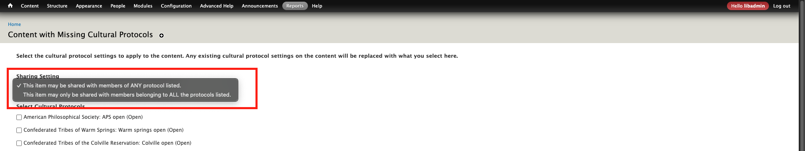

Use the checkboxes to select the appropriate protocol(s).
If there is a protocol you want to use and it is not listed here, ensure that the active user account is a protocol steward for the protocol in question.
Click "next".

A confirmation list will be displayed. If the list looks correct, click "confirm".

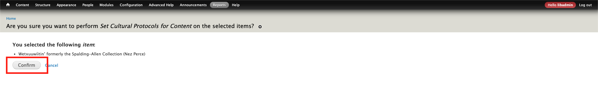

Finally a confirmation message will be displayed. You can then return to the pre-migration report summary to repeat the above steps for other content if needed, or move on to additional steps.

### Media assets (atoms) with no assigned protocols

   - In Mukurtu 4 cultural protocols are required for ALL media assets.
   - In Mukurtu 3 protocols were optional, but recommended.
   - You will most likely be able to use the bulk processing tool to add protocols to all media assets without one, but some may require manual editing.

The Scald Atoms with missing cultural protocols report will allow you to filter, select, and apply bulk actions to update affected media assets.
If you have media assets that already had a protocol assigned during their creation, they will not be listed here.

If necessary, filter by media type.

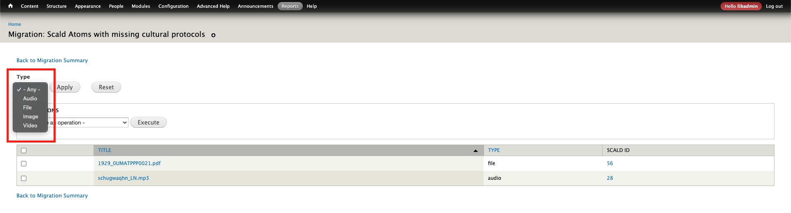

If you need to review media assets one by one, you can click on the title to go to the media asset page.
If you want to bulk process media, from the operations dropdown select one of the two actions:
- "Duplicate cultural protocols from item"
  - This is going to be the most commonly used action.
  - It will look at the protocol(s) used on the content and apply those same protocols to the media assets.
  - This will mostly apply in cases where for public content users didn't bother applying protocols to media assets, or where for non public content protocols were missed on media assets.
- "Set cultural protocols for scald atoms".
  - On many sites this action may not be needed at all.
  - It allows you to manually set protocols on media assets and works the same as "Content (nodes) with no assigned protocols" - see above for instructions.
  - This will be used if there are media assets that are NOT included in any content. In this case you may instead prefer to delete unused media assets, or create a "to be reviewed" protocol to ensure that the migration can be complete and you can review them later.
  - It can also be used in cases where you want a different protocol between content and media assets, but it is likely that you have already implemented that, since it's usually the case where media assets will have a stricter protocol than the content.

Some media assets may require manually assigning a protocol. Likely cases include:
- Where a media asset has been used in multiple content (eg: in a DH item and set as a collection image)

Select the media assets using the check boxes (you can select all content by using the checkbox in the top row).
Click "execute".

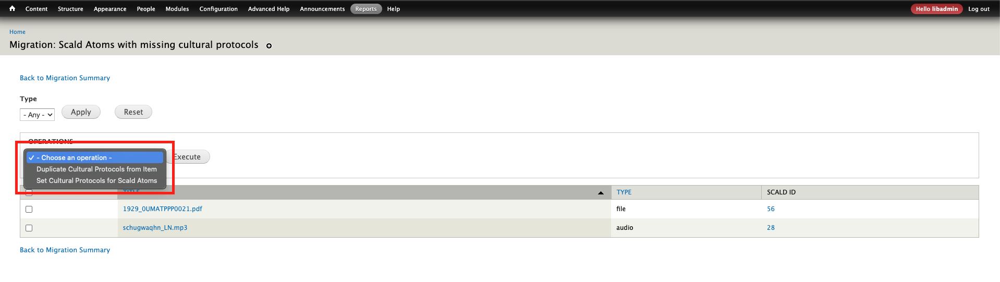

If the list looks correct, click "confirm".

A confirmation message will be displayed.

### Text formats "Markdown" and "Display Suite code"

- In Mukurtu 4 the "markdown" and "display suite code" formats are no longer supported in the default HTML field editor. Plain text, basic HTML, and Full HTML are still supported.
- These formats are most commonly used to implement custom styling on basic pages, community pages, and in some DH items.
- This setting will need to manually changed on all field that use one of these formats.
- If you have used either format to achieve specific styling, it may be replicable with one of the HTML settings in Mukurtu 4. We recommend taking screenshots of the pages and copying the code you wrote so that it can be reviewed and re-implemented after migration.
- This may affect any kind of site node, eg: basic pages, community pages, protocol pages, DH items (Traditional Knowledge, Cultural Narrative, Description fields), Collection (Description field).

From the Text formats Markdown and Display Suite code report page, one-by-one, click on the title of the content to be edited.
> TEXT FORMAT SUMMARY NEEDS TO BE ADDED, SCREENSHOT NEEDED

For a page, click "page menu" and "edit".

For content, click "item menu" and "edit".

Located the affected HTML field(s). They will list "Display suite code" or "markdown" in the dropdown menu below the text box.

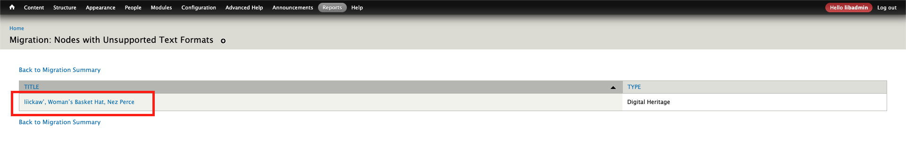

Change the setting to "plain text", "filtered HTML", or "full html" as needed. Save the page or content (not shown).

### Dictionary words with additional media
> NEED BETTER SCREENSHOTS

   - In Mukurtu 4 the single HTML "additional media" field has been replaced by two new fields: thumbnail (image only) and media assets (all media types, the same as the digital heritage item media assets field.) 
   - The contents of the additional media field will NOT be migrated.
   - You will need to manually move any media assets used in the Mukurtu 3 additional media field into the new thumbnail or media assets field if you want them to be included in the migration.
   - This can also be accomplished with regular batch update tools if preferred.

From the Dictionary words with additional media report, click on the dictionary word to be edited.

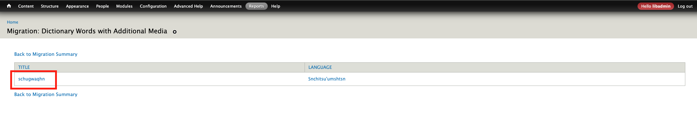

From the "item menu" at the lef tof the page, select "edit". 

If necessary, inspect the embedded media asset to find its name. Locate the media asset(s) in the media library, and drag and drop them into the new "additional media addets" field.

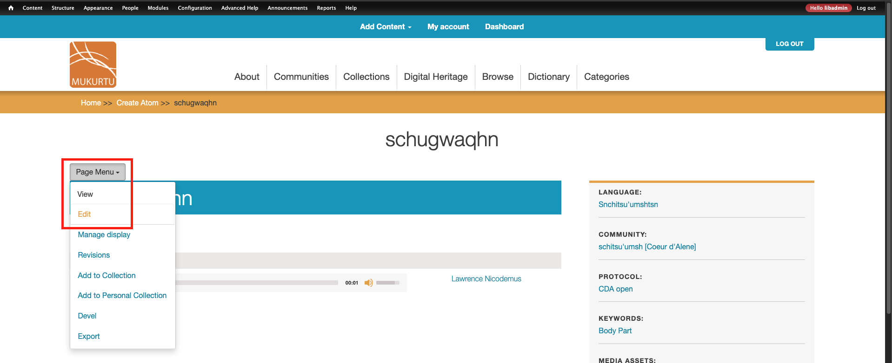

Ensure that the new field is showing the media assets, then delete the contents of the old "additional media" field.

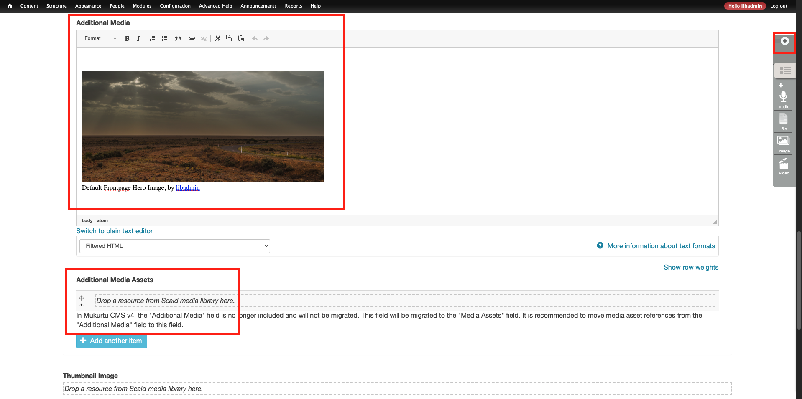

Save the item (not shown).

### Dailymotion media assets (atoms)

   - Support for Dailymotion has been dropped in Mukurtu 4. We are not aware of any Mukurtu sites actively using Dailymotion.
   - Dailymotion media assets will NOT be migrated.
   - There is no automated process to resolve Dailymotion videos.
   - If you have any Dailymotion videos, you will need to...
     1) Move them to a different hosting platform (either Vimeo or Youtube) or upload them directly to the site (not recommended).
     2) Create new media assets for the newly hosted videos.
     3) Replace the Dailymotion media assets with the new media assets in any DH items or other content where they are used.
     4) Delete the old Dailymotion media assets.

> SCREENSHOTS NEEDED?

### Scald authors field

   - The Scald "Authors" (scald_authors) field will not be migrated to Mukurtu 4. There is a separate "author" field that automatically records the user responsible for uploading the media asset.
   - No action is required, you can leave this field populated and it will not affect the migration.
   - If you do choose to resolve these messages follow the steps below. This can also be accomplished with regular batch update tools if preferred.

From the Scald Authors report, click on the title of the media asset to be edited.

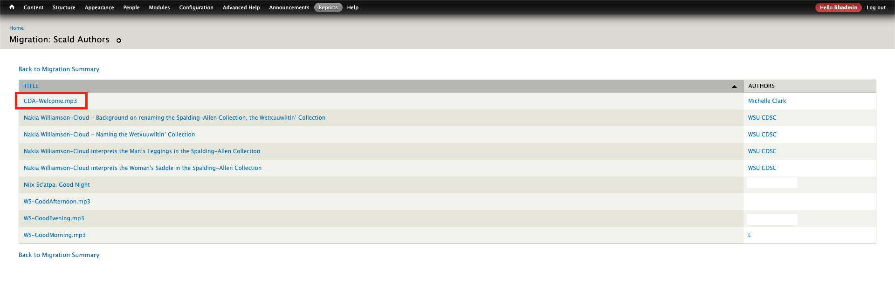

From the "page menu" select "edit".

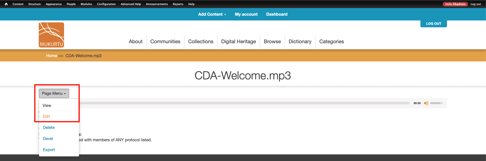

Expand the "additional fields" section.

Locate the "authors" field and delete any terms. If you need to preserve these terms, consider entering them in the "people" or "contributor" field, as appropriate.

With the field empty, click "Finish".

A confirmation message will be displayed.

## Pre-migration work complete

When you have completed the pre-migration activities, the report will indicate:
- There are no nodes using unsupported text formats
- All content has cultural protocols
- All Scald Atoms have cultural protocols
- No dictionary words have additional media
- No Dailymotion atoms are found
- No Scald Authors terms are found, if you removed them. If you choose to leave them they will still be reported, but will not be migrated, or affect the migration.

**If any of these are incomplete and you proceed with the migration, there will be corresponding data loss, and the migration as a whole may fail.**

> If you continue to work on the site after completing the migration activities, and before running the migration, please ensure that any new and updated content will pass the pre-migration report (eg: when creating a new collection, ensure that it uses protocols).
> 
> If you are not planning to work on the site between completing the migration activities and running the migration, consider placing the site in maintenance mode to prevent unintentional changes.
> 
> **In all cases, we STRONGLY recommend running a final pre-migration report before migration and then placing the site in maintenance mode to prevent changes being made.**

