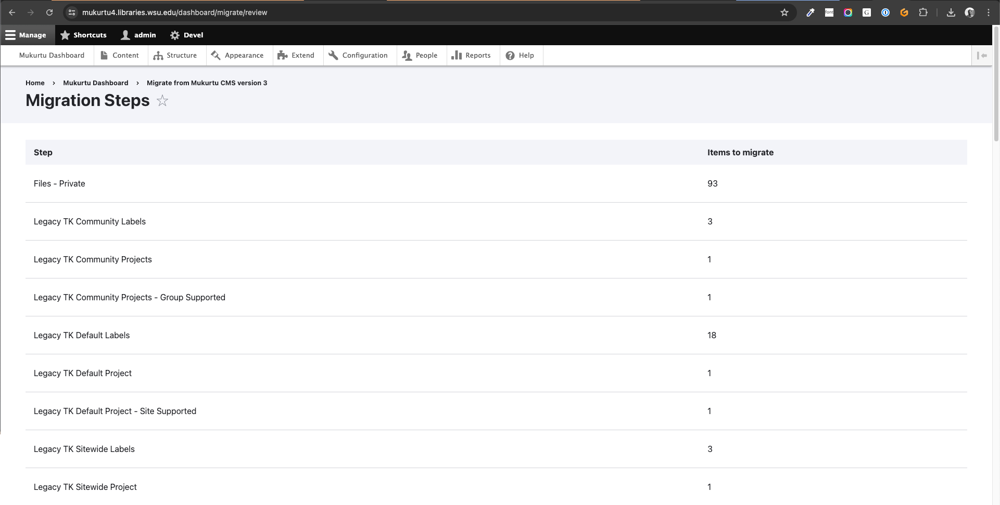

# Running the Mukurtu 3 to Mukurtu 4 migration

> These steps assume that you are migrating within the same hosting environment. If you are changing hosting providers or hosting environments please contact [support@mukurtu.org](mailto:support@mukurtu.org).

Go to /dashboard/migrate or from the dashboard, click on "Migrate from Mukurtu CMS version 3"

> You will NOT be able to run a migration if there is any content in your new Mukurtu 4 site. A migration can only be attempted on a freshly-built Mukurtu 4 site that has not been used at all.

Review the preparation steps and click "Continue" when ready.

Enter the Mukurtu 3 database credentials you identified earlier (Preparing Migration Credentials). 

- Database Type
  - If you are using Reclaim Hosting and your current database was "mysql", select "MariaDB".
- Database Host
  - If you are using Reclaim Hosting it will probably be "localhost".
- Database Name
  - It will probably be a randomly generated username.
- Database Username
  - It will probably be the same as the database name.
- Database Password
  - It will be a randomly generated password.
- Document root for public files
  - It may be something like "/var/www/html/[sitename]"
  - If you are using Reclaim Hosting is may be something like "/home/[domain]/public_html/[site]"
- Document root for private files
  - It may be something like "/var/www/html/[sitename]/sites/default/files/private"
  - If you are using Reclaim Hosting is may be something like "/home/[domain]/public_html/[site]/sites/default/files/private"

Click "Review migration".

The migration steps will be displayed. You likely do not need to review these in depth, but the item counts should match your Mukurtu 3 site (eg: number of media assets by type, number of DH items). You may want to take a screenshot of these to comapre with the migration results.
When ready, click "Begin migration".

The migration will run, showing the progress as it goes. This may take some time to run, especially on large sites. 
DO NOT reload, refresh, close, or navigate away from this page until it is complete.

A confirmation message will be displayed. You may choose to compare the results of the migration to the migration steps earlier.
The content migration is now complete!

