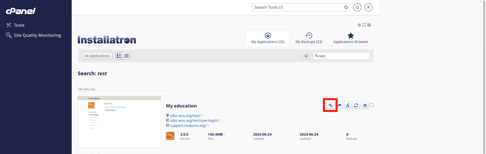
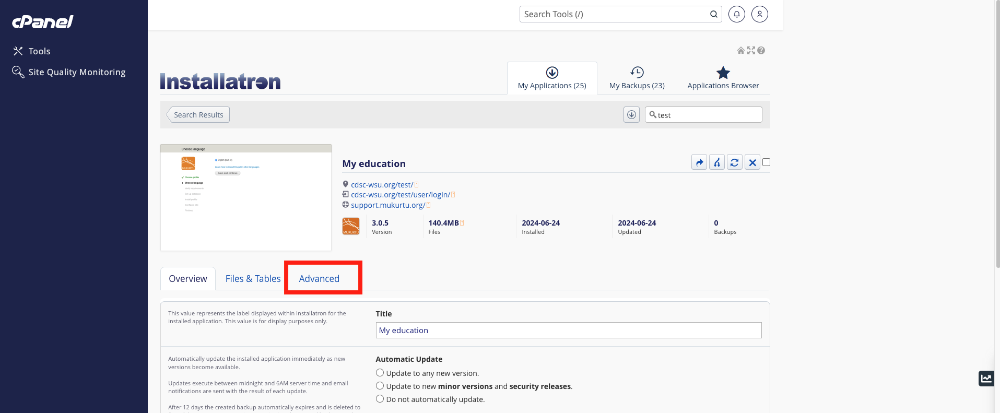
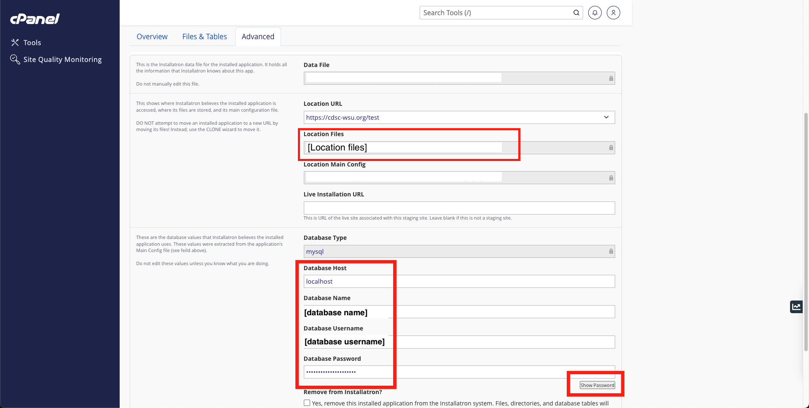

# Preparing Migration Credentials

Before you can run the migration, you will need to collect database credentials from your Mukurtu 3 site. We recommend doing this in advance of migration and recoding this information somewhere accessible so you can copy and paste it into your new Mukurtu 4 site when prompted.

You will need to preapre the following database settings and credentials.
- Database type
- Database host
- Database name
- Database username
- Database password
- Document root for public files
- Document root for private files

> This assumes that you are migrating within the same hosting environment. If you are changing hosting providers or hosting environments please contact [support@mukurtu.org](mailto:support@mukurtu.org).

## Finding database credentials for Reclaim Hosted sites

Go to the Reclaim Client Portal ([https://portal.reclaimhosting.com/clientarea.php](https://portal.reclaimhosting.com/clientarea.php)) and login with your **Reclaim** account.

Click on "cPanel". If you have multiple accounts, select the correct account from the dropdown menu.

Click on " My Apps".

Locate your Mukurtu 3 site and click on the settings icon.

Select the "advanced" tab.

Record the following information. We recommend copying this into a local text document.
- Location Files
  - It will probably be something like "/home/[domain]/public_html/[site]"
  - This will be used to fill in the document root information.
- Database Type
  - It will probably be "mysql".
- Database Host
  - It will probably be "localhost".
- Database Name
  - It will probably be a randomly generated username.
- Database Username
  - It will probably be the same as the database name.
- Database Password
  - Click on the "show password" button to expose this.
  - It will be a randomly generated password.
 
> These are not the same credentials you use to log in to Reclaim or to the site itself.

## Finding database credentials for self hosted sites

Contact your server/system administrator. They should be directly involved in this process. If they have any questions about this information or the migration process, please contact [support@mukurtu.org](mailto:support@mukurtu.org).
