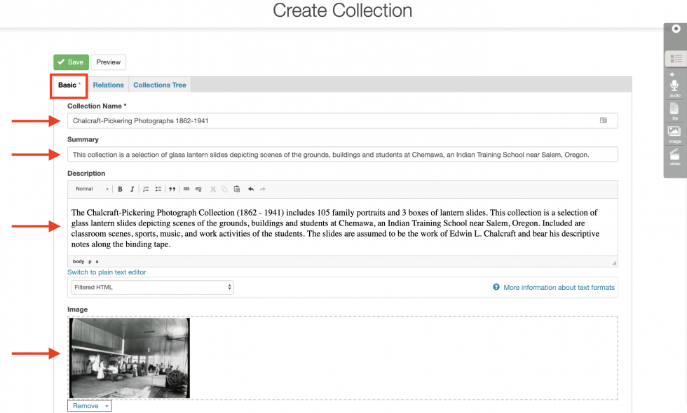

# Pre-Migration Activities

## Update Mukurtu 3

You will need to update your Mukurtu 3 site to the most current release (Version 3.XXX) to enable the new pre-migration tools. This process is the same as previous updates. 

If you are hosting with Reclaim Hosting, see these instructions to update your site: [Updating a Reclaim Hosted Mukurtu CMS Site](https://mukurtu.org/support/updating-a-reclaim-hosted-mukurtu-cms-site/)

## Run the pre-migration report

You can access the pre-migration report directly at /admin/reports/migration/summary (eg: https://mysite.com/admin/reports/migration/summary).

You can also access the report by following the "View Migration Preparation Summary" link on your dashboard.

## Resolve pre-migration activities

