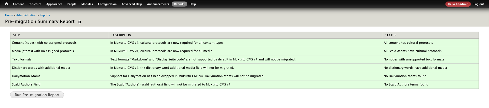

# Pre-Migration Activities

We have built a pre-migration report that will identify all site content that needs to updated or modified before it can be migrated, and any content settings that will not be migrated. There are six categories included in the pre-migration report:

1) Text formats "Markdown" and "Display Suite code"
   - These formats are not supported by default in Mukurtu 4 and will not be migrated.
   - These formats are most commonly used to implement custom styling on basic pages, community pages, and in some DH items.
   - You will need to manually change these fields to use a supported format.
2) Content (nodes) with no assigned protocols
   - In Mukurtu 4 cultural protocols are required for ALL content types.
   - In Mukurtu 3 protocols were optional for dictionary words and collections, and were not included for person records and word lists.
   - You will most likely be able to use the bulk processing tool to add protocols to all content without one, but some content may require manual editing.
3) Media assets (atoms) with no assigned protocols
   - In Mukurtu 4 cultural protocols are required for ALL media assets.
   - In Mukurtu 3 protocols were optional, but recommended.
   - You will most likely be able to use the bulk processing tool to add protocols to all media assets without one, but some may require manual editing.
4) Dictionary words with additional media
   - In Mukurtu 4 there is both a thumbnail and an additional media field, and the additional media field works quite differently than in Mukurtu 3.
   - The contents of the additional media field will NOT be migrated.
   - You will need to manually move any media assets used in the Mukurtu 3 additional media field into the new thumbnail or additional media field if you want them to be included in the migration.
5) Dailymotion media assets (atoms)
   - Support for Dailymotion has been dropped in Mukurtu 4. We are not aware of any Mukurtu sites actively using Dailymotion.
   - Dailymotion media assets will NOT be migrated.
   - If you have any Dailymotion videos, you will need to move them to a different hosting platform and manually update the media assets and content that references them.
6) Scald authors field
   - The Scald "Authors" (scald_authors) field will not be migrated to Mukurtu 4. We are not aware of any Mukurtu sites actively using this field.
   - No action is required.

## Update Mukurtu 3

You will need to update your Mukurtu 3 site to the most current release (Version 3.XXX) to enable the new pre-migration tools. This process is the same as previous updates. 

If you are hosting with Reclaim Hosting, see these instructions to update your site: [Updating a Reclaim Hosted Mukurtu CMS Site](https://mukurtu.org/support/updating-a-reclaim-hosted-mukurtu-cms-site/)

## Run the pre-migration report

You can access the pre-migration report directly at /admin/reports/migration/summary (eg: https://mysite.com/admin/reports/migration/summary).

You can also access the report by following the "View Migration Preparation Summary" link on your dashboard.

The report should run automatically, but you can click the "Run Pre-migration Report" button at any time to re-run the report. Your report will likely look something like this (but with more items identified).

## Resolve pre-migration activities

Each category will have a summary in the "status" field on the right, which includes a link to a more detailed report and actions.

### Text formats "Markdown" and "Display Suite code"

"There are __ nodes with these text formats: [NIDs]."
> UPDATES NEEDED

### Content (nodes) with no assigned protocols

"__ items(s) with missing cultural protocols: Details"
   - In Mukurtu 4 cultural protocols are required for ALL content types.
   - In Mukurtu 3 protocols were optional for dictionary words and collections, and were not included for person records and word lists.
   - You will most likely be able to use the bulk processing tool to add protocols to all content without one, but some content may require manual editing.

### Media assets (atoms) with no assigned protocols

"__ atom(s) with missing cultural protocols: Details"
   - In Mukurtu 4 cultural protocols are required for ALL media assets.
   - In Mukurtu 3 protocols were optional, but recommended.
   - You will most likely be able to use the bulk processing tool to add protocols to all media assets without one, but some may require manual editing.

### Dictionary words with additional media

"__ dictionary word(s) with additional media: Details"
   - In Mukurtu 4 there is both a thumbnail and an additional media field, and the additional media field works quite differently than in Mukurtu 3.
   - The contents of the additional media field will NOT be migrated.
   - You will need to manually move any media assets used in the Mukurtu 3 additional media field into the new thumbnail or additional media field if you want them to be included in the migration.

### Dailymotion media assets (atoms)

"No Dailymotion atoms found"
   - Support for Dailymotion has been dropped in Mukurtu 4. We are not aware of any Mukurtu sites actively using Dailymotion.
   - Dailymotion media assets will NOT be migrated.
   - If you have any Dailymotion videos, you will need to move them to a different hosting platform and manually update the media assets and content that references them.

### Scald authors field

"__ atom(s) use the Authors field: Details"
   - The Scald "Authors" (scald_authors) field will not be migrated to Mukurtu 4. There is a separate "author" field that automatically records the user responsible for uploading the media asset.
   - No action is required, you can leave this field populated and it will not affect the migration.
   - 

## Pre-migration work complete

When you are done running all the pre-migration activities, the report will indicate that...
- There are no nodes using these text formats.
- All content has cultural protocols
- All Scald Atoms have cultural protocols
- No dictionary words have additional media
- No Dailymotion atoms found
- No Scald Authors terms found

> Please keep in mind that if you are continuing to work on the site before running the migration, you will need to ensure that new and update content will pass the pre-migration report (eg: when creating a new collection, ensure that it uses protocols). Shortly before beginning a migration, we STRONGLY recommend running a final pre-migration report and then placing the site in maintenance mode to prevent changes being made.
